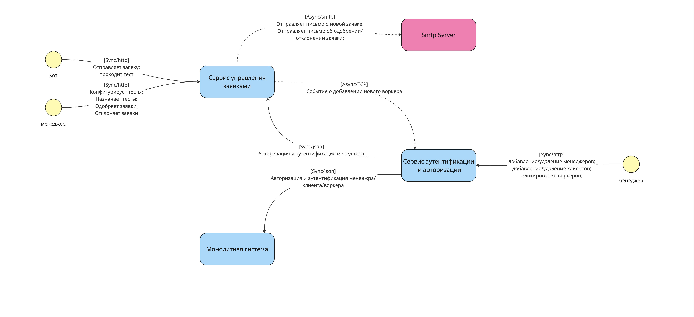
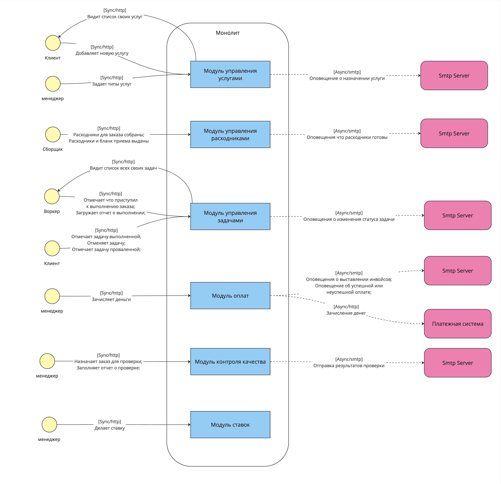

## Структуры системы

### Общий вид

#### Описание

В общем виде система состоит из 3х приложений:

1. `Сервис управления заявками` для устройства котов в шатат.
В этом сервисе:
    - коты могут оставить заявку
    - менеджеры создавать наборы тестов для заявок и вакансий, назначать тесты на заявки, апрусить и отклонять заявки котов

Вынесения логики управления заявками позволит нам:
  - отедльно маштабировать данный сервис, т.к. ожидается большое кол-во заявок и ддос от наших конкуретнов
  - изолировать работу основной части приложения, в случае ддоса от конкурентов
  - повысить скорость и надежность доставки изменений до наших пользователей

2. `Сервис аутентификации и авторизации` - сервис содержит логику отвечающую за авторизацию и аутентификацию, а так же ролевую систему

3. `Монолтиная система`

### Монолит

