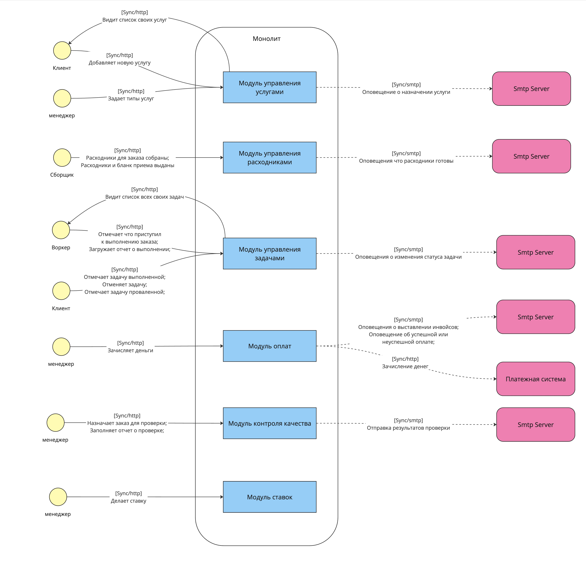

## Структуры системы

### Общий вид

#### Описание

В общем виде система состоит из 3х приложений:

- `Сервис управления заявками` отвечает за функционал устройства котов в шатат.
В этом сервисе:
    - коты могут оставить заявку
    - менеджеры создавать наборы тестов для заявок и вакансий, назначать тесты на заявки, апрусить и отклонять заявки котов

  Вынесение логики управления заявками позволит нам:
    - отедльно маштабировать данный сервис, т.к. ожидается большое кол-во заявок и ддос от наших конкуретнов
    - изолировать работу основной части приложения, в случае ддоса от конкурентов
    - повысить скорость и надежность доставки изменений до наших пользователей

- `Сервис аутентификации и авторизации` - содержит логику отвечающую за авторизацию и аутентификацию

    Функционал авторизации и аутентификации необходим для работы двух приложений, при сбое в одного приложения, второе должно продолжать работать, по-этой причине мы не можем интегрировать этот функционал ни в монолит, ни в сервис управления заявками, в связи с чем было решено выделить этот функционал в отдельный сервис, чтобы была возможность обеспечить ее высокую доступность и безопасность.

- `Монолитная система` - модульный модулит содержащий все модули: управления услугами, управления расходниками, управления задачами, управления оплатами, контроль качества и ставки.

    Было решено делать модульный монолит, т.к. ожидается что нагрузка будет не большая на эту часть приложения, а модульность позволит нам получить необходимый низкий TTM.

### Монолит

Монолит состоит из следующих модулей:

- `Модуль управления услугами` - в модуле сосредоточена логика связанная с услугами: управление типами услуг; добавление новых услуг; матчинг воркеров; назначение цены на услугу.
- `Модуль управления расходниками` - в модуле сосредоточена логика связанная с расходниками по задачам: заказ печенья; сбор расходников; отметка о выдачи расходников и бланков приема.
- `Модуль управления задачами` - в модуле сосредоточена логика связанная с выполнением задач воркерами: отметка о начале выполнения заказа; загрузка отчета о выполнении заказа; изменение статуса заказа клиентом.
- `Модуль оплат` - в модуле сосредоточена логика связанная с оплатами: фиксирует выполненые заказы и штрафы по проваленным заказам; генерирует инвойсы для клиентов и воркеров; списывает и зачисляет средства.
- `Модуль контроля качества` - в модуле сосредоточена логика связанная с контролем качества выполнения заказов: назначение заказа на проверку, заполнение отчетов выполнения заказа; фиксация гипотиз для улучшения бизнеса.
- `Модуль ставок` - в модуле сосредоточена логика связанная со ставками: прием ставок; определение выгравших и проигравших ставок; автоматический расчет выгрыша.